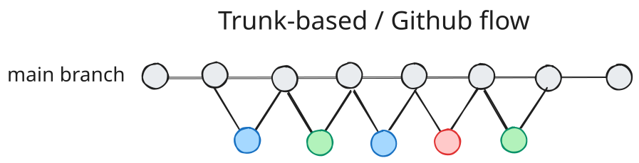
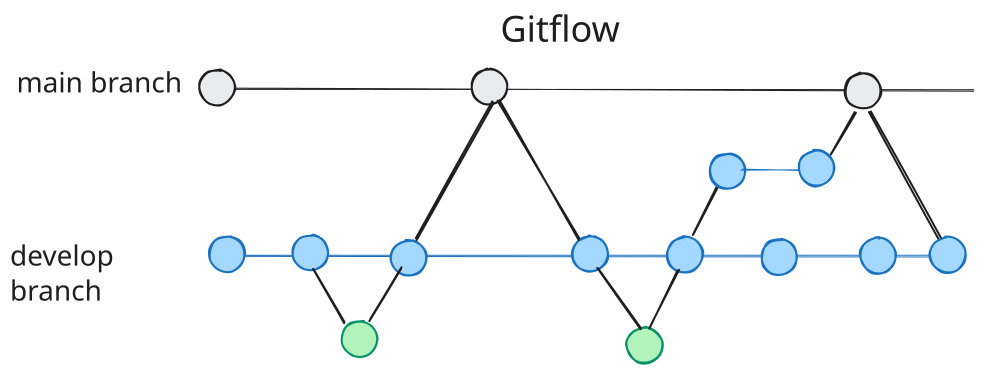
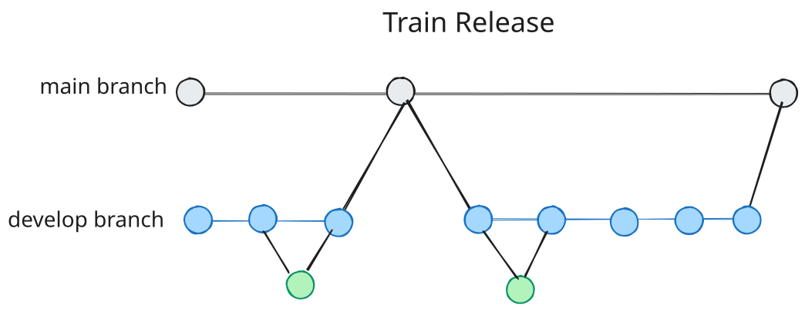
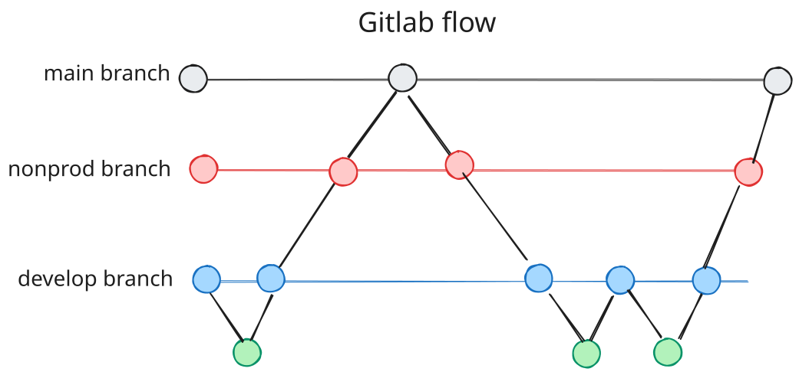

# example-zerv-flow

Every branch is e2e-testable before merge. No environment branches.

This repository is a working example of **zerv-flow**, a mechanism with two
moving parts: a **label** lets a pull request borrow a real environment
temporarily (the lease), and a **lock** makes contention over a borrowed
environment fail loudly instead of silently. It runs zerv-flow on
trunk-based development: main is production and the only long-lived
branch, every environment is built from it, and a merge to main deploys
the same fresh commit to development, nonproduction, and production in
one pass. The whole of zerv-flow costs a PR label.

The long-form story, with the reasoning behind the lease and the lock, is
the companion post: [Stupidly simple branching: trunk-based, but
e2e-testable](https://wisl.dev/blog/stupidly-simple-branching/).

Along the way, every artifact in every environment carries a full version
computed from the Git state by [**zerv**](https://github.com/wislertt/zerv):
`1.1.3-alpha.1.post.2` says the deployment descends from `v1.1.2`, carries a
feature branch's work, and is two commits past its base.

## How it works

### The lease: a label borrows an environment

A pull request labeled `deploy-n` temporarily makes that branch represent
the nonproduction environment: its deploys land in real nonproduction, its
artifact carries its version, and the environment reads from the branch
instead of from main. The names are this repository's shorthand, not the
mechanism: any label that names an environment works, so `deploy-dev` and
`deploy-staging` are equally valid spellings. `deploy-d` and `deploy-p`
borrow the other environments the same way, and the labels stack: one PR
carrying both `deploy-d` and `deploy-n` holds two leases at once, each
environment with its own lock.

The word that matters is **temporarily**. The lease ends on events, not on
a timer: remove the label, merge the PR, or close the PR, and the
environment is main's again. Nothing long-lived is created and there is no
branch to keep in sync. An unlabeled PR costs nothing: the deploy only runs
when a `deploy-*` label is present.

### The lock: contention fails loudly

A label declares intent. When two branches both declare it, the lock is the
referee: one lock per environment key records who owns `d`, `n`, or `p`
right now. The first PR to deploy acquires the lock. The second fails:
failure means the environment is genuinely held, and deploying into it
would corrupt exactly the test the first branch is running. No queue, no
retry, no silent override.

Recovery is as small as the machinery. Locks live as branches backed by the
lock key, so a lock that outlives its holder (a CI job that dies mid-run, a
PR that closed without ever deploying) is fixed by deleting the lock branch.
`delay_before_start_in_sec` on the shared lock exists for repos where a
release job can race a PR's unlock; set it only if you observe that failure.

## Quick start

1. Fork this repository
2. Install zerv locally for testing
3. Create a PR to test the workflow
4. Add `deploy-d`, `deploy-n`, `deploy` and `pre-release` labels

## Deployment flow examples

The following scenarios demonstrate the full cycle in practice:

- **Initial State**: Only the main branch exists. All environments
  (development, nonproduction, production) and environment-less deployments
  reference version `v1.1.2` from the main branch. At rest, every
  environment is main: branches carry code, main carries the environments.
  

- **Feature Branch Deployment**: A `feature/1` branch is created with PR
  labels `deploy-n` and `deploy`. The lease borrows nonproduction: it
  deploys version `v1.1.3-alpha.1.post.2` from the feature branch and locks
  the slot to it. Development and production remain on main `v1.1.2`. The
  environment-less deployment creates a new version
  `v1.1.3-alpha.1.post.2` without overriding previous versions.
  

- **Concurrent Feature Deployment**: While `feature/1` PR is active, a
  `feature/2` branch is created with PR labels `deploy-d`, `deploy-n`, and
  `deploy`. Nonproduction deployment fails at the lock: the environment is
  genuinely held by `feature/1`. Development deploys successfully with
  version `v1.1.3-alpha.2.post.3` from `feature/2`. The environment-less
  deployment creates another new version alongside the existing one.
  

- **Release to Production**: The `feature/1` PR merges to main, triggering
  a new release `v1.1.3`. The merge deploys main to every environment not
  held by a lease (here, nonproduction and production) and the lease ends:
  main owns nonproduction again, now running exactly what
  the branch proved. Development remains locked by `feature/2` with version
  `v1.1.3-alpha.2.post.3`. The environment-less deployment creates a new
  version `v1.1.3`.
  

- **Update Feature Branch**: The `feature/2` branch is updated from main
  (rebase/merge), picking up the new `v1.1.3` tag. Zerv regenerates the
  version to `v1.1.4-alpha.2.post.4`. Its next labeled deploy acquires the
  freed lock, and the cycle continues, one version behind main. The
  environment-less deployment creates a new version
  `v1.1.4-alpha.2.post.4`.
  

## Prerequisites

- Main branch tagged with semantic version format (major.minor.patch) - recommend using [semantic-release](https://github.com/semantic-release/semantic-release)
- For multiple long-lived branches (e.g., git flow with develop branch): Enable "Require branches to be up to date before merging" protection rule for main branch
- Deployment pipeline must follow function pattern and be idempotent. There are 2 common deployment patterns:
    - `deploy_without_env(repo, versions)`: For immutable releases (e.g., Python packages)
        - Each new version does not override previous versions
        - Example: Publishing to PyPI with incrementing version numbers
    - `deploy_with_env(repo, env_name, versions)`: For environment-specific deployments (e.g., Cloud Run services)
        - New version overrides existing version in specified environment

Idempotency is what makes real shared environments safe to borrow: good
suites clean up after themselves, and when a lease ends, redeploying main
puts the environment back to a known state.

## Deployment Assumptions for This Repo (Configurable)

- **Environment codes**: d (development), n (nonproduction), p (production) following [GCP landing zone convention](https://docs.cloud.google.com/architecture/blueprints/security-foundations/summary#naming-conventions)
    - Note: These can be configured to any naming convention (e.g., dev/staging/prod)
- **Version formats**: This repository demonstrates 3 formats:
    - Semver: For git repository tags and releases
    - PEP440: For Python package versions
    - Docker Tag: For container registry tags
    - Note: This demo repository only echoes these formats as examples, but in a real deployment pipeline they would be used for their respective purposes.
    - Note: Configure zerv to generate formats based on your deployment requirements and constraints. See [zerv documentation](https://github.com/wislertt/zerv) for all supported formats.
- **Deployment triggers**: Uses PR labels with configurable prefixes:
    - `deploy-` prefix for environment-specific deployments (e.g., `deploy-d`, `deploy-n`)
    - `deploy` for environment-less deployments (e.g., immutable releases)
    - `pre-release` for creating release candidates with tagging
    - These label prefixes can be configured to match your deployment naming conventions

## Branch Rules and Version Generation (Configurable)

This repository uses the default branch rules from `zerv flow` command. For complete implementation details, see the [shared workflow](https://github.com/wislertt/zerv/blob/main/.github/workflows/shared-zerv-versioning.yml).

- **Feature branches** (default): Generate alpha pre-releases with branch-based identification
    - Numbered feature branches (`feature/1/xyz`): Extracts number from branch name
        - Example: `1.0.1-alpha.1.post.1+feature.1.xyz.1.g4e9af24`
    - Non-numbered feature branches (`feature/xyz`): Uses 5-digit hash for identification
        - Example: `1.0.1-alpha.48993.post.1+feature.xyz.3.g4e9af24`
    - Uses commit distance for post count

- **"develop" branch**: Generates beta pre-releases with stable numbering (fixed at `beta.1`)
    - Example: `1.0.1-beta.1.post.1+develop.3.g4e9af24`
    - Uses commit distance for post count

- **"beta/\*" branches**: Generate beta pre-releases with extracted numbering
    - Numbered (`beta/2/xyz`): `1.0.1-beta.2.post.1+beta.2.xyz.1.g4e9af24`
    - Non-numbered (`beta/xyz`): 5-digit hash identifies the RC number
    - Uses commit distance for post count

- **"release/\*" branches**: Generates release candidates with extracted or hash-based numbering
    - Regular release branches: `1.0.1-rc.1.post.1.dev.1764382150+release.1.do.something.3.g4e9af24` (full version)
    - With `pre-release` label: `1.0.1-rc.1.post.1` (short version, creates tag)
    - Numbered release branches (`release/1/xyz`): `1.0.1-rc.1.post.1`
    - Non-numbered release branches (`release/xyz`): `1.0.1-rc.48993.post.1` (5-digit hash RC number)
    - Post count bumps by 1 per deploy (repeated RC deploys increment it); full versions add a `dev` timestamp component when the branch is ahead of its tag

- **Customization**: All branch rules can be configured with `--branch-rules` argument

## Zerv Flow with Common Branching Strategies

Zerv-flow is not a branching strategy; the label and the lock do not care
what branching strategy feeds them. This repository runs them on
trunk-based, and the same two mechanisms adapt to the others.

- **Trunk-based / GitHub Flow** (the home case):
    - Structure: Main branch + short-lived feature branches
    - Compatible out-of-the-box with default branch rules
      

- **GitFlow** (Adaptive - not 100% traditional GitFlow):
    - Structure: Main + develop long-lived branches + feature/release/hotfix branches
    - A release branch can hold a lease on `n` while it bakes, and every artifact it produces already carries a version
    - Simplified release branches: `release/1/feature-name` or `release/feature-name` (no manual version bumping needed)
    - Requirements: Enable "Require branches to be up to date before merging" for main branch protection rule
    - Configuration: Update branch rules if develop branch has different name
    - Note: This adapts traditional [GitFlow](https://nvie.com/posts/a-successful-git-branching-model/) (designed 2010, pre-CI/CD) for modern workflows.
      

- **Release Trains**:
    - Structure: Main + develop as accumulation branch, feature branches from develop, periodic releases
    - Process: Create release branches from develop on schedule, merge to main for releases; each train's release branch borrows environments per departure
    - Requirements: Enable "Require branches to be up to date before merging" for main branch protection rule
      

- **GitLab Flow (Environment Branches)**:
    - Note: Not designed to support this strategy by default
    - Could work with custom configuration but considered out of scope: environment branches are permanent representations that drift from the code they claim to represent, and the label is the same power with the permanence removed
      

## Speed vs Quality Tradeoff

- Flexible deployment controls to match your team's needs
- Example for higher quality nonproduction: Only allow `deploy-n` on `release/*` branches, with required PR reviews before merging to release branch
- Example for fast POC development: Allow `deploy-p` directly in PRs for rapid iteration (accepting potential failures in production environment)
- Adapt the strategy to your context - balance speed vs quality based on your project requirements

## Contributing

Contributions are welcome! Please feel free to submit a Pull Request. For major changes, please open an issue first to discuss what you would like to change.

## License

This project is licensed under the Apache License 2.0 - see the [LICENSE](LICENSE) file for details.
